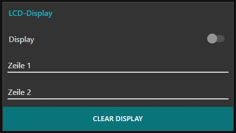

# LCD-Display

Die in diesem Repository enthaltenen Dateien ermöglichen das Ansteuern eines HD44780 LCD-Displays.
Die Daten werden per MQTT an einen Raspberry Pi oder Arduino gesendet und dann über I²C an das Display übertragen.

Dazu wird folgendes benötigt:
  * Raspbbery Pi / Arduino
  * MQTT-Broker (zum Beispiel [Mosquitto](https://mosquitto.org/))

  * LCD-Display (HD44780)
  * I²C Display Adapter
  * I²C Logik Level Konverter (nur für Raspberry Pi)

## Raspberry Pi
Die Ansteuerung erfolgt mit Python.

### Schaltplan

### Software
  * Pakete installieren: `sudo apt-get install python-smbus i2c-tools`
  * Python MQTT Client installieren: `pip install paho-mqtt`
  * I²C in der `raspi-config` freischalten
  * In der Datei `/etc/modules` am Ende folgende Zeilen eintragen:
    * `i2c-bcm2708`
    * `i2c-dev`
  * Neustarten `sudo reboot`

  * mit `sudo i2cdetect -y 1` die I²C-Adresse herausfinden und in `lcddriver.py` bei `ADDRESS` eintragen

In der Datei `Display_MQTT.py` muss nun die IP-Adresse des MQTT-Brokers unter `client.connect("192.168.x.x", 1883, 60)` eingetragen werden.

Anschließend wird das Skript mittels `python Display_MQTT.py` gestartet.

## Arduino
Es ist ein netzwerkfähiger Arduino notwendig, beispielsweise ein ESP8266.

Zunächst müssen die Wifi-Zugangsdaten und die IP-Adresse des Brokers in den Sketch eingetragen werden. Danach kann dieser kommpiliert und geflasht werden.

### Schaltplan

Sollte der verwendete Arduino keine 5V liefern, gibt es weitere Anschlussmöglichkeiten:
  * an 3,3V anschließen - Display wird nicht so hell
  * an VIN anschließen - unschön
  * __externe 5V mit Logik Level Konverter__ - beste Alternative

## Nutzung
Als Default hören die Skripte auf das Topic `LCD-Display/#`.
Zur __Steuerung__ wird auf `LCD-Display/command` _on_, _off_ oder _clear_ gepublished.
Der __Text__ für jede Zeile ist der Payload der Topics `LCD-Display/lineX`: `LCD-Display/line1`.

### NodeRED
Der enthaltende Flow ermöglicht:
  * Ein- und Ausschalten
  * Display löschen
  * Zeichen zeilenweise anzeigen

## Python Shell
Des Weiteren besteht die Möglichkeit, das Display über die Shell mittels Python anzusteuern.
Dazu wird als erster Parameter angegeben, ob ein Kommando ausgeführt oder Text angezeigt werden soll.
Der zweite Parameter ist dann das entsprechende Kommando oder der anzuzeigende Text.

1. command
    * on
    * off
    * clear
2. line1
3. line2

### Beispiele
* `python Display_Shell.py command on`
* `python Display_Shell.py line1 "Hallo Welt"`

Bei jedem neuen Aufruf wird das Display zurückgesetzt, sodass es nicht möglich ist, Text in beiden Zeilen gleichzeitig anzuzeigen. Dazu kann das Skript aber entsprechend angepasst werden.
